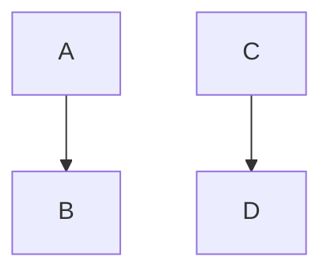

<!DOCTYPE html>
<html lang="en">
   <head>
	
	
</head>

<body>
# Headline

 > An awesome project.

 <pre><code class="language-mermaid">graph LR
A--&gt;B
</code></pre>

graph LR
A--&gt;B

	

	
</body>

</html>

